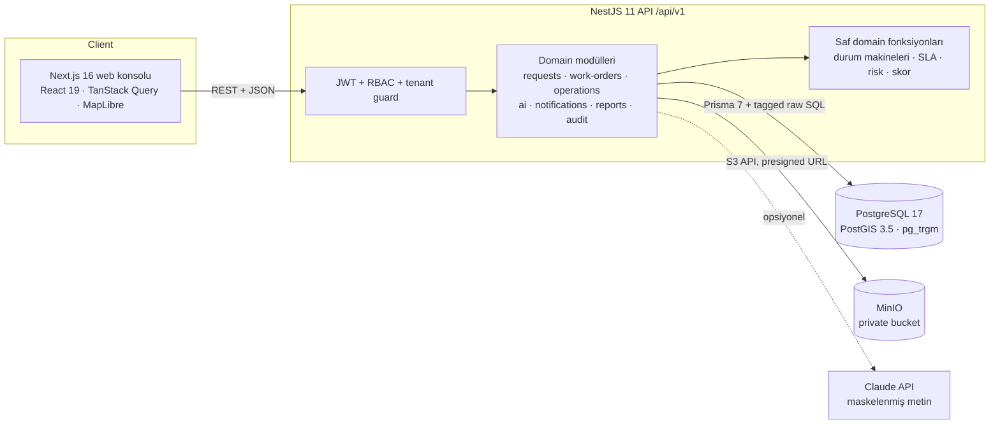

# KENT360

**Akıllı Belediye Operasyon ve Kent Zekâsı Platformu**
_Smart Municipal Operations & Urban Intelligence Platform_

KENT360, vatandaşın fotoğraf ve harita konumuyla yaptığı bir bildirimi; AI destekli sınıflandırma, mükerrer tespiti, müdürlük yönlendirme, saha iş emri ve önce/sonra fotoğraf kanıtıyla kapanışa kadar yöneten; bu operasyon verisinden mahalle bazlı **kent zekâsı** üreten çok kiracılı (white-label) bir web platformudur.

> **Durum:** Web MVP tamamlandı (Phase 0–11 ve 13). Saha360 mobil uygulaması (Phase 12) **opsiyonel bir gelecek uzantısıdır** ve bu sürümde yoktur; saha adımları web konsolundan, aynı API ile yürütülür. Ayrıntı: [roadmap](docs/DEVELOPMENT_ROADMAP.md).

---

## Problem

Belediyelerde vatandaş talepleri telefon, e-posta ve sosyal medya gibi dağınık kanallardan gelir. Aynı çukur onlarca kez bildirilir, hangi müdürlüğün sorumlu olduğu elle belirlenir, sahaya çıkan ekibin işi bitirdiği kanıtlanamaz ve SLA (hedef çözüm süresi) aşımları geç fark edilir. Yöneticiler ise "hangi mahallede ne kötüleşiyor?" sorusuna veriyle cevap veremez.

## Çözüm

Tek bir talep yaşam döngüsü ve tek bir veri modeli:

1. **Bildirim** – vatandaş kategori, açıklama, harita konumu ve fotoğraf gönderir; mahalle PostGIS ile otomatik bulunur.
2. **AI önerisi + mükerrer tespiti** – kategori/müdürlük/öncelik önerilir, 150 m içindeki benzer açık talepler açıklanabilir bir skorla gösterilir; vatandaş yeni kayıt yerine mevcut talebe **katılabilir**.
3. **Yönlendirme ve SLA** – müdürlük ve SLA, kategoriden sunucuda ve değişmez "snapshot" olarak atanır.
4. **İş emri ve saha** – iş emri ekibe/personele atanır; sahada konum doğrulaması (PostGIS mesafe), önce/sonra fotoğrafı zorunluluğu, yönetici doğrulaması.
5. **Kent zekâsı** – mahalle metrikleri, açıklanabilir risk skoru, kural tabanlı anomaliler, ısı haritası, raporlar ve CSV.

## Öne Çıkan Özellikler

| Modül                      | Ne yapar                                                                                                                      |
| -------------------------- | ----------------------------------------------------------------------------------------------------------------------------- |
| **Kent Operasyon Merkezi** | Kapsamlı KPI'lar (bugün, açık, kritik, açık iş emri, ortalama çözüm, SLA uyumu), 30 günlük trend, kritik kuyruk, canlı harita |
| **Talep Yönetimi**         | Durum makinesi, SLA takibi (riskte / aşıldı), zaman çizelgesi, öncelik ve müdürlük değişikliği, vatandaş için sade görünüm    |
| **İş Emirleri ve Saha**    | Ekip/personel ataması ve geçmişi, saha adımları, PostGIS yakınlık kontrolü, önce/sırasında/sonra fotoğraf kanıtı, doğrulama   |
| **Canlı Harita**           | MapLibre, bbox sorguları, kümeleme, mahalle katmanı, talep yoğunluğu ısı haritası, mahalle risk choropleth'i                  |
| **MahallePulse**           | Mahalle metrikleri, 0–100 açıklanabilir risk skoru ve bileşenleri, kural tabanlı anomaliler, 30/90 günlük trend               |
| **AI ve Mükerrer Tespiti** | Sağlayıcı soyutlaması (varsayılan kural tabanlı, opsiyonel Claude), PostGIS + pg_trgm hibrit benzerlik skoru, talebe katılma  |
| **Bildirimler**            | Uygulama içi gelen kutusu: atama, iş emri, SLA riskte/aşıldı, vatandaşa talep güncellemesi; topbar zili (polling)             |
| **Raporlama ve Audit**     | 5 rapor, ekranda özet, Excel uyumlu CSV; denetim kaydı ekranı, okunabilir ve temizlenmiş değişiklik detayı                    |
| **Platform**               | Çok kiracılı izolasyon, white-label marka, izin tabanlı RBAC ve nesne kapsamları, değiştirilemez audit, Türkçe arayüz         |

## Mimari

Tek deploy edilen bir **modüler monolit**: katı domain modüllerine ayrılmış NestJS API + PostgreSQL/PostGIS. Talep, iş emri, geçmiş, audit ve bildirim aynı transaction'da yazılır; mikroservis karmaşası yerine tutarlılık ve sade operasyon tercih edildi.



- **Controller → Service → saf `domain/` fonksiyonları → Prisma.** Durum değişimi yalnız geçiş uç noktalarıyla (`POST /…/transitions`), asla serbest `PATCH { status }`.
- **Kiracı izolasyonu** `prisma.forTenant(municipalityId)` ile otomatik; raw SQL'de `municipality_id` elle ve nesne kapsamı (`requestReadScope`, `workOrderReadScope`) SQL'e çevrilerek uygulanır.
- **Veritabanı kuralları**: geometri tetikleyicileri, CHECK kısıtları, değiştirilemez alan tetikleyicileri, append-only `audit_logs`.

Ayrıntı: [ARCHITECTURE.md](docs/ARCHITECTURE.md) · [DATABASE_DESIGN.md](docs/DATABASE_DESIGN.md) · [API_DESIGN.md](docs/API_DESIGN.md)

## Teknoloji Yığını

| Katman     | Teknoloji                                                                                                       |
| ---------- | --------------------------------------------------------------------------------------------------------------- |
| Backend    | NestJS 11, TypeScript 5.9 (strict), Prisma 7 (`@prisma/adapter-pg`), class-validator, Zod, Swagger, pino        |
| Veritabanı | PostgreSQL 17, PostGIS 3.5, pg_trgm                                                                             |
| Web        | Next.js 16 (App Router), React 19, Tailwind CSS 4, Radix, TanStack Query, React Hook Form + Zod, Lucide         |
| Harita     | MapLibre GL JS, OpenFreeMap altlığı                                                                             |
| Depolama   | MinIO (S3 API), private bucket, kısa ömürlü presigned URL, sharp ile yeniden kodlama                            |
| AI         | Sağlayıcı soyutlaması; varsayılan kural tabanlı sınıflandırıcı, opsiyonel `@anthropic-ai/sdk` (Claude)          |
| Altyapı    | Docker Compose (PostgreSQL/PostGIS, Redis, MinIO). Redis çoklu instance için hazır tutulur; API şu an kullanmaz |
| Kalite     | Jest, Supertest (e2e, ayrı test DB'si), ESLint 9, Prettier                                                      |

## Güvenlik

- **Kimlik:** kısa ömürlü access token (bellekte) + httpOnly, `SameSite=Strict`, yolu `/api/v1/auth` ile sınırlı refresh çerezi; refresh rotasyonu ve yeniden kullanım tespiti (aile iptali); hesap kilitleme; argon2id.
- **Yetki:** izin tabanlı RBAC (`@Permissions`), nesne kapsamları (müdürlük, ekip, kendi talebi, takip ettiği talep); başka kiracının kaydı her zaman 404.
- **Girdi ve çıktı:** DTO doğrulama (whitelist), tagged raw SQL (`$queryRawUnsafe` yasak), Helmet, CORS izin listesi, rate limit.
- **Medya:** dosya imzası kontrolü, meta verisiz yeniden kodlama, private bucket, yalnız kısa ömürlü imzalı URL.
- **KVKK:** AI sağlayıcısına yalnız maskelenmiş açıklama gider; vatandaş benzer talepleri yalnız kamuya açık alanlarla görür; CSV'de açıklama ve bildiren yoktur.
- **Audit:** kritik işlemler aynı transaction'da kaydedilir; parola, token, çerez gibi alanlar yazılırken temizlenir; audit ekranı gövde, prompt, tarayıcı ve oturum bilgisini hiç göstermez.
- **Raporlar ve bildirimler:** CSV formül enjeksiyonuna karşı korumalı; bildirimlerde sahiplik kuralı (başkasının bildirimi → 404).

Ayrıntı: [SECURITY.md](docs/SECURITY.md)

## GIS

- Talep ve iş emri noktaları `geometry(Point, 4326)`; lat/lng'den DB tetikleyicisiyle üretilir, GIST index'li.
- Mahalle bulma `ST_Covers`, harita `ST_MakeEnvelope` bbox sorguları, saha yakınlığı `ST_DistanceSphere`.
- Aktif mahalle sınırları alan olarak çakışamaz (kesişim > 1 m² → red, advisory lock altında); GeoJSON içe aktarma.
- Harita: kümeleme, ısı haritası, risk choropleth, mahalle tıklamasında risk kartı.

> Demo mahalle **isimleri gerçek, sınırları uydurma dikdörtgenlerdir** – resmi sınır değildir. Gerçek veri GeoJSON içe aktarma ile yüklenebilir.

## AI / Mükerrer Tespiti

- `AiProvider` arayüzü: `analyzeRequest`, `suggestCategory`, `suggestPriority`, `summarize`. Varsayılan **MockAiProvider** kategori anahtar kelimeleriyle deterministik ve açıklanabilir sonuç verir; `AI_PROVIDER=anthropic` + `AI_API_KEY` ile Claude kullanılır. Anahtar yoksa ya da hata/zaman aşımı olursa sistem kural tabanlı sınıflandırıcıya düşer.
- **AI karar vermez:** öneri yalnız formu doldurur; seçilen kategori, öneri ile karşılaştırılıp kaydedilir.
- **Mükerrer skoru (0–1):** mesafe (PostGIS, ≤ 150 m) + kategori + metin benzerliği (pg_trgm) + zaman; ≥ 0,60 "muhtemel benzer". Açıklama örneği: _"55 m uzakta · aynı kategori · 3 saat önce · metin %88 benzer"_. Otomatik birleştirme yoktur.

## MahallePulse

- Mahalle başına toplam, açık, çözülen, kritik, açık iş emri, SLA aşım oranı, ortalama çözüm süresi, en sık kategori, 7/30 gün ve önceki 30 güne göre değişim – tek gruplu SQL ile.
- **Risk skoru 0–100** beş ağırlıklı bileşenden (açık yük, SLA aşımı, kritik oran, artış, yavaş çözüm) hesaplanır ve her bileşen gerekçesiyle gösterilir. Kural tabanlıdır, AI olarak sunulmaz.
- **Anomali:** son 7 gün, önceki 4 haftanın haftalık ortalamasıyla karşılaştırılır; en az 3 bildirim, ortalamanın 1,5 katı ve +2 şartı olmadan uyarı üretilmez.

## Demo Hesapları

`npm run db:seed` ile oluşturulur. **Yalnızca geliştirme içindir**; seed `NODE_ENV=production` ile çalışmayı reddeder.

| Rol                 | E-posta                 | Parola         |
| ------------------- | ----------------------- | -------------- |
| Sistem Yöneticisi   | `admin@kent360.local`   | `Kent360!Demo` |
| Müdürlük Yöneticisi | `manager@kent360.local` | `Kent360!Demo` |
| Ekip Sorumlusu      | `leader@kent360.local`  | `Kent360!Demo` |
| Saha Personeli      | `field@kent360.local`   | `Kent360!Demo` |
| Vatandaş            | `citizen@kent360.local` | `Kent360!Demo` |

## Local Setup

Gereksinimler: **Node.js 22+**, npm 10+, **Docker Desktop**.

```powershell
git clone <repo-url> kent360
cd kent360
Copy-Item .env.example .env
npm install                 # shared-types derlenir, Prisma client üretilir
npm run infra:up            # PostgreSQL/PostGIS, Redis, MinIO (+ bucket)
npm run db:deploy           # migration'lar
npm run db:seed             # demo belediyesi, hesaplar, talepler, iş emirleri, bildirimler
npm run dev                 # API :4000 + web :3000
```

- Web: http://localhost:3000 · Swagger: http://localhost:4000/api/docs
- Sağlık: http://localhost:4000/health · Hazırlık: http://localhost:4000/health/ready (veritabanı + depolama)
- Web, `NEXT_PUBLIC_*` değerlerini `apps/web/.env.local`'dan okur (`apps/web/.env.example`).
- Harita altlığı OpenFreeMap'tir (internet gerekir, API anahtarı gerekmez).

> **Fotoğraflar yeniden başlatmadan sonra görünmüyorsa:** Docker Desktop bazen MinIO'nun port yönlendirmesini bozar (`/health/ready` → `storage: down`). `docker compose up -d --force-recreate minio` ile düzelir; veri volume'da kalır.

### Demo verisini tazeleme (`demo:refresh`)

Demo verisi seed anına göre üretilir; günler geçtikçe "bugün", son 7 günün anomalileri ve SLA dağılımı eskir. Bunun için **yalnız geliştirme / demo** veritabanında çalışan bir komut vardır:

```powershell
npm run demo:refresh            # kuru çalıştırma: hedef veritabanını ve kaydırmayı gösterir
npm run demo:refresh -- --yes   # uygular
```

- Demo belediyesinin talep, iş emri, geçmiş, fotoğraf, analiz ve bildirim zaman damgalarını aynı miktarda ileri kaydırır; en son kayıt "şimdi" olur. Hiçbir kayıt silinmez, `audit_logs` dokunulmaz.
- `NODE_ENV=production`, yerel olmayan veritabanı sunucusu ve `*_test` veritabanlarında **çalışmayı reddeder**; `--yes` olmadan hiçbir şey değiştirmez.
- Uygulama başlarken otomatik olarak çalışmaz.

## Demo

5–8 dakikalık sunum akışı (giriş → dashboard → harita → vatandaş talebi → AI → mükerrer → iş emri → saha kanıtı → doğrulama → MahallePulse → rapor/audit): [DEMO_SCENARIO.md](docs/DEMO_SCENARIO.md).
Ekran görüntüsü listesi ve CV açıklamaları: [PORTFOLIO_GUIDE.md](docs/PORTFOLIO_GUIDE.md).

## Testler

```powershell
npm run lint; npm run typecheck; npm run format:check
npm test                              # unit testler (domain kuralları, CSV, audit görünümü, bildirim kuralları …)
npm run test:e2e -w @kent360/api      # API e2e – tüm uygulamayı ayağa kaldırır, infra açık olmalı
```

E2e testleri aynı PostgreSQL sunucusunda ayrı bir `kent360_test` veritabanı ve `kent360-media-test` bucket'ı kullanır (otomatik oluşturulur ve migrate edilir); geliştirme veritabanına dokunulmaz. Kapsam: kimlik doğrulama ve oturum, RBAC ve kiracı izolasyonu, talep ve iş emri iş akışları, medya, dashboard/harita/arama, MahallePulse, AI ve mükerrer, bildirim sahipliği, rapor kapsamı ve CSV güvenliği, audit filtreleri ve hassas alan temizliği.

## Proje Yapısı

```
kent360/
├── apps/
│   ├── api/                 NestJS API
│   │   ├── prisma/          schema, migration'lar, seed, demo-refresh
│   │   ├── src/common/      hata modeli, guard'lar, pagination, kiracı kapsamı
│   │   ├── src/modules/     auth, requests, work-orders, operations, ai,
│   │   │                    notifications, reports, audit, …
│   │   └── test/            e2e testleri
│   ├── web/                 Next.js konsolu (yönetim + vatandaş)
│   │   └── src/{app,components,hooks,lib,providers}
│   └── mobile/              Saha360 – opsiyonel gelecek uzantısı (yalnız README)
├── packages/
│   ├── shared-types/        enum'lar, izin kataloğu, API sözleşmeleri
│   └── config/              ortak tsconfig + ESLint
├── infrastructure/          Postgres init SQL, MinIO bucket script
├── docs/                    mimari, veritabanı, API, UI/UX, güvenlik, roadmap, demo, portfolyo
└── docker-compose.yml
```

## Roadmap

| Faz | Kapsam                                                          | Durum                                |
| --- | --------------------------------------------------------------- | ------------------------------------ |
| 0   | Mimari, monorepo, dokümantasyon                                 | ✅                                   |
| 1   | Docker, PostGIS, Redis, MinIO, Prisma veri modeli               | ✅                                   |
| 2   | Backend temeli (config, hata modeli, log, Swagger, health)      | ✅                                   |
| 3   | Kimlik doğrulama, RBAC, audit                                   | ✅                                   |
| 4   | Belediye domaini + seed                                         | ✅                                   |
| 5   | Talep yönetimi, iş akışı, SLA                                   | ✅                                   |
| 6   | İş emirleri, ekipler, önce/sonra kanıtı                         | ✅                                   |
| 7   | Web temeli (layout, tasarım sistemi, giriş)                     | ✅                                   |
| 8   | Yönetim arayüzü (dashboard, arama)                              | ✅                                   |
| 9   | GIS: canlı harita, kümeleme                                     | ✅                                   |
| 10  | MahallePulse analitiği                                          | ✅                                   |
| 11  | AI sınıflandırma ve mükerrer tespiti                            | ✅                                   |
| 12  | Saha360 mobil                                                   | ⏸ Opsiyonel mobil uzantı / ertelendi |
| 13  | Bildirimler, raporlar, audit ekranı, son sağlamlaştırma ve cila | ✅                                   |

**Web MVP: tamamlandı.** Olası sonraki adımlar (zorunlu değil): Saha360 mobil uygulaması, e-posta/SMS bildirim kanalları, gerçek zamanlı güncellemeler (SSE), AI isabet raporu.

## Dokümantasyon

[Proje özeti](docs/PROJECT_OVERVIEW.md) · [Mimari](docs/ARCHITECTURE.md) · [Veritabanı](docs/DATABASE_DESIGN.md) · [API](docs/API_DESIGN.md) · [UI/UX](docs/UI_UX_GUIDE.md) · [Güvenlik](docs/SECURITY.md) · [Roadmap](docs/DEVELOPMENT_ROADMAP.md) · [Demo](docs/DEMO_SCENARIO.md) · [Portfolyo rehberi](docs/PORTFOLIO_GUIDE.md)
